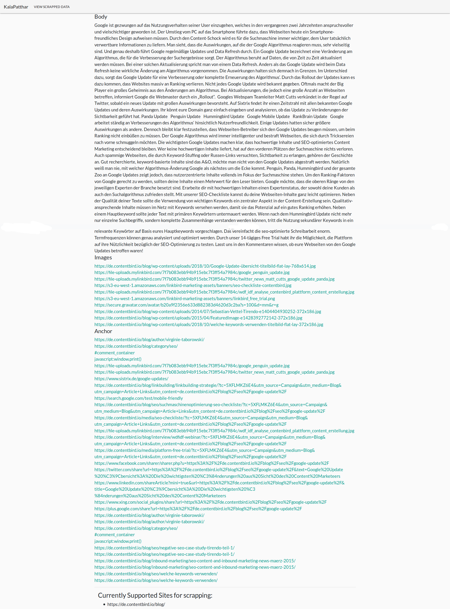

# KalaPatthar
> KalaPatthar is a scrapy based blog extractor tool.

## Run locally

1. Create a virtual environment

2. Install Requirements
    ```bash
    pip install -r requirements.txt
    ```
    OR 
    ```bash
    pipenv install
    ```

3. Migrate models
    ```bash
    python manage.py migrate
    ```

4. Run the django server
```bash
python manage.py runserver
```

*Note: Models can be modified according to the usecase*

### Demo Screenshots

1. The index page

    

2. The scrapped data rendered by querying the db
    
    
    
3. For each blog post, following fields are extracted:
    - body
    - image sources
    - anchor links
    - anchor tags
    
    
    
---
Libraries used:
- Scrapy
- Django2
- Scrapyd

---

[girisagar46@gmail.com](girisagar46@gmail.com)

> Kala Patthar, meaning 'black rock' in Nepali and Hindi, is a notable landmark located on the south ridge of Pumori in the Nepalese Himalayas above Gorakshep.